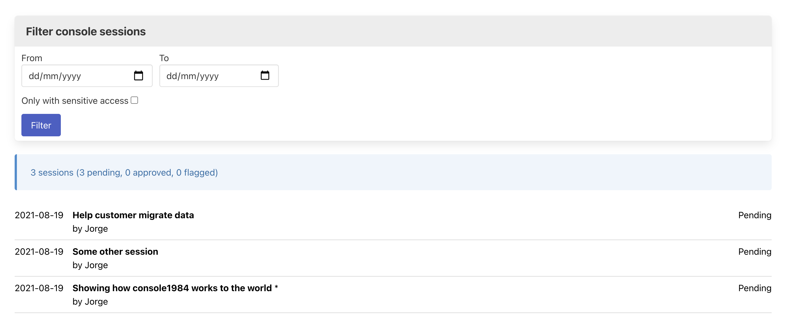
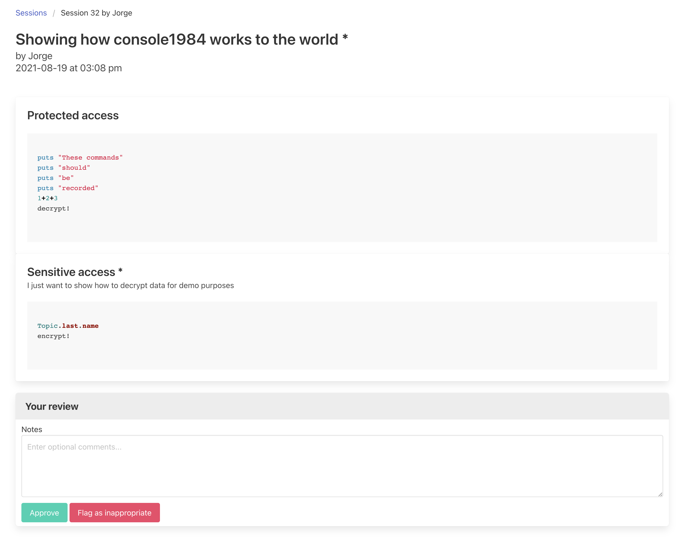

[](https://github.com/basecamp/audits1984/actions?query=branch%3Amaster)

# Audits1984

A simple auditing tool for [`console1984`](https://github.com/basecamp/console1984).

## Installation

Add it to your `Gemfile`:

```ruby
gem 'audits1984'
```

Create tables to store audits in the database:

```sh
rails audits1984:install:migrations
rails db:migrate
```

Mount the engine in your `routes.rb`:

```ruby
mount Audits1984::Engine => "/console"
```

### Authenticate auditors

By default, the library controllers will inherit from the host application's `ApplicationController`. To authenticate auditors, you need to implement a method `#find_current_auditor` in your `ApplicationController`. This method must return a record representing the auditing user. It can be any model but it has to respond to `#name`.

For example, Imagine all the staff in your company can audit console sessions:

```ruby
def find_current_auditor
  Current.user if Current.user&.staff?
end
```

## Usage

The main screen lists the registered console sessions. It includes a form to filter sessions by date, and also to only show that contains sensitive accesses.



You can click on a session to see its commands and choose whether it was an appropiate console usage or not.



After making a decision on the session, you will be redirected to the next pending session, based on the filter configured in the main screen.

That is. I said it was simple.

## Configuration

These config options are namespaced in `config.audits1984`:

| Name                  | Description                                                  |
| --------------------- | ------------------------------------------------------------ |
| auditor_class         | The name of the auditor class. By default it's `::User.`     |
| auditor_name_attribute | The attribute on the auditor class that returns the auditor's name. By default it's `:name`. |
| base_controller_class | The host application base class that will be the parent of `audit1984` controllers. By default it's `::ApplicationController`. |
